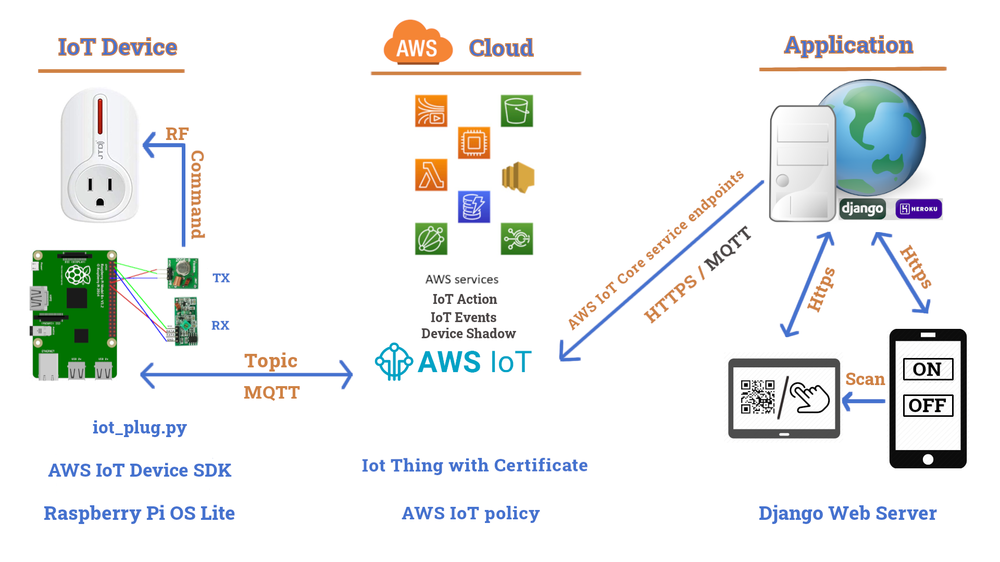
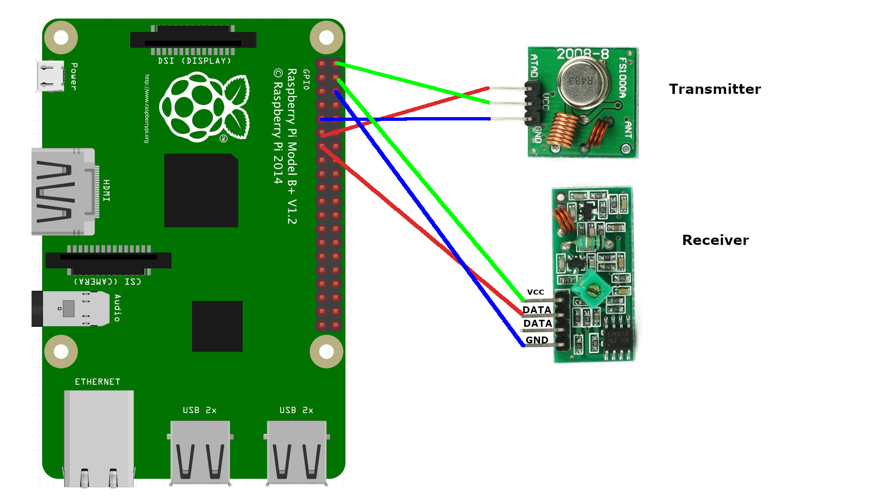
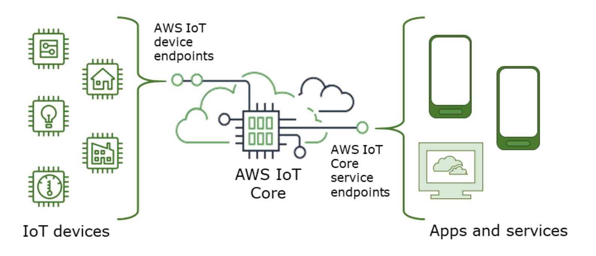
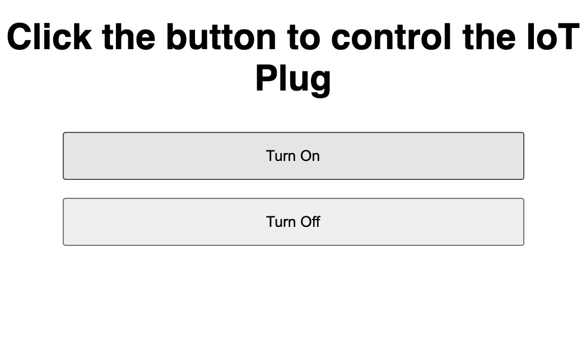
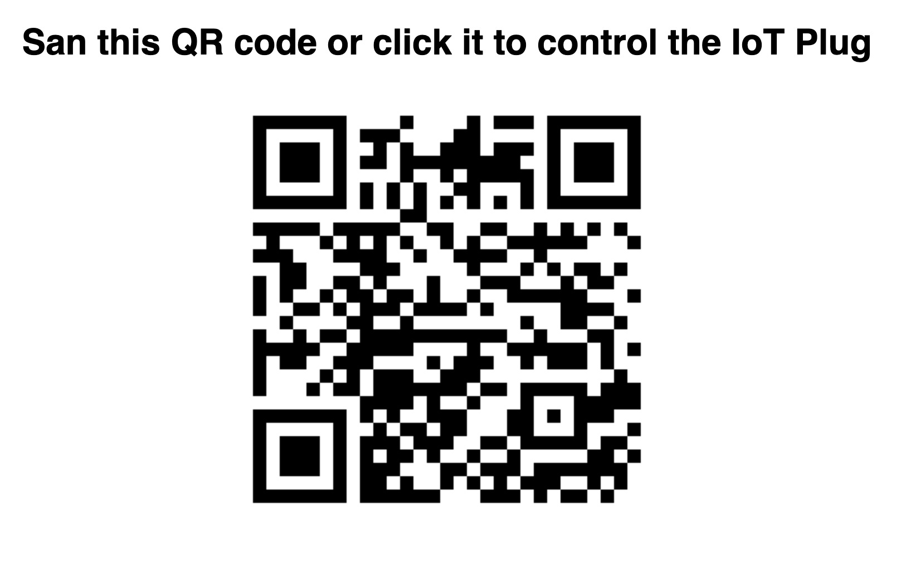

# Turns RF plug into AWS IoT device with Raspberry Pi

Setup a Raspberry Pi as internet of things to connect to the [AWS IoT core](https://aws.amazon.com/iot-core/). And build a web page with two buttons to
trigger the [RF remote plug](https://www.amazon.com/JTD-Generation-Auto-programmable-Electrical-Appliances/dp/B01JPOUJN4/). The web page is built with [Django](https://www.djangoproject.com/) framework.

In this project, you will learn the basic concepts of IoT and get hands-on experience about how to make communications between IoT thing and AWS IoT Core service.

Here is the video to demonstrate this project in Chinese with some keynotes subtitle in English.

[](https://www.youtube.com/watch?v=E7LaaKPGeuQ)


## Table of Contents

- [Background](#background)
- [Hardware](#hardware)
- [Prepare Raspberry Pi](#prepare-raspberry-pi)
- [Use Pi to control the RF plug](#Use-Pi-to-control-the-RF-plug)
- [Setup an IoT thing in AWS](#Setup-an-IoT-thing-in-AWS)
- [Connect Pi to AWS IoT Core Service](#connect-pi-to-aws-iot-core-service)
- [Communicate with AWS IoT Core Service endpoint](#communicate-with-aws-iot-core-service-endpoint)
- [Final Test](#final-test)

## Background

The RF plug is a power outlet controlled by a remote running under a radio frequency of 315/433mHz. But it does not support "cell phone control" through the internet Also, I want to learn how to build IoT service with Amazon AWS, so I started this project. The final result is to use cell phone to scan a QR code, then a webpage with 'On' and 'Off' buttons will show on the phone. You can click the On/Off button to control the RF plug.

The structure of the project is like this:




## Hardware

1. Raspberry Pi (the one I have is [Pi 3 Model B](https://www.amazon.com/dp/B01LPLPBS8/))

2. RF plug https://www.amazon.com/dp/B01JPOUJN4/
3. FR Module, you can find it in many places at a very low price https://www.amazon.com/dp/B01DKC2EY4
4. Breadboard and wires https://www.amazon.com/dp/B07H7V1X7Y/


## Prepare Raspberry Pi

1. Using [Raspberry Pi Imager](https://www.raspberrypi.org/documentation/installation/installing-images/) to install Raspberry Pi OS Lite and enable SSH connection

    ```sh
    # Use default username:pi and password:raspberry to login
    $ sudo systemctl enable ssh
    $ sudo systemctl start ssh
    ```
2. Connect RF modules to the Pi
 


## Use Pi to control the RF plug
1. Install the [rpi-rf] module on Pi to operate the RF modules

    ```sh
    $ sudo apt-get update
    $ sudo apt-get upgrade
    $ sudo apt-get install git
    $ sudo apt-get install -y python3-setuptools
    # install pi.gpio  
    $ sudo apt-get install python3-dev python3-rpi.gpio
    # Suggest to install rpi-rf from the source code
    $ git clone https://github.com/milaq/rpi-rf.git
    $ cd rpi-rf
    $ sudo python3 setup.py install
    ```

2. Catch the control code from the RF remote controller.

    ```sh
    $ cd ~/rpi-rf/script
    # get the RF control code
    $ ./rpi-rf_receive
    # Button On:[INFO] rpi-rf_receive: 1340675 [pulselength 172, protocol 1]
    # Button Off:[INFO] rpi-rf_receive: 1340684 [pulselength 171, protocol 1]
    ```

3. Send RF control code from Pi to control the plug
    
    ```sh
    $ rpi-rf_send -p 170 -t 1  1340675   # turn on the plug
    $ rpi-rf_send -p 170 -t 1  1340684   # turn off the plug
    ```
## Setup an IoT thing in AWS

Following this instruction: [Create AWS IoT resources](https://docs.aws.amazon.com/iot/latest/developerguide/create-iot-resources.html)

\* **Pay attention to the 'region' selections, make sure all the operations are done in the same AWS region**\*

    Thing: my_thing

    Policy: iotplug_policy

    Download Certifications and rename them to

        private.pem.key

        public.pem.key(not used in these examples)

        device.pem.crt

        Amazon-root-CA-1.pem
    HTTPS Endpoint:
        abcdef12345-ats.iot.us-west-2.amazonaws.com

## Connect Pi to AWS IoT Core Service

Amazon provides many AWS IoT SDK [options](https://docs.aws.amazon.com/iot/latest/developerguide/iot-connect-devices.html#iot-connect-device-endpoints), such as Python, Javascript, Java, C++, and Embedded C.

```sh
# login to the pi. Replace the ip address with yours
$ ssh pi@192.168.1.104
$ sudo apt-get install cmake
$ sudo apt-get install libssl-dev
# install Python version of AWS IoT SDK
# Highly recommend to install this SDK from the source code
$ git clone https://github.com/aws/aws-iot-device-sdk-python-v2.git
$ python3 -m pip install ./aws-iot-device-sdk-python-v2
# upload certifications to this 'certs' folder on the pi
$ mkdir certs
# exit from the pi
$ exit
# upload certifications
$ scp -r private.pem.key pi@192.168.1.104:/home/pi/certs/
$ scp -r device.pem.crt pi@192.168.1.104:/home/pi/certs/
$ scp -r Amazon-root-CA-1.pem pi@192.168.1.104:/home/pi/certs/
# login back to the pi
$ ssh pi@192.168.1.104
$ cd aws-iot-device-sdk-python-v2/samples/
# run the sample code
$ python3 pubsub.py --topic topic_1 --root-ca ~/certs/Amazon-root-CA-1.pem --cert ~/certs/device.pem.crt --key ~/certs/private.pem.key --endpoint abcdef12345-ats.iot.us-west-2.amazonaws.com
# you are going to see something like this:
# Subscribing to topic 'topic_1'...
# Subscribed with QoS.AT_LEAST_ONCE
# Sending messages until program killed
# Publishing message to topic 'topic_1': Hello World! [1]
# Received message from topic 'topic_1': b'Hello World! [1]'
# Publishing message to topic 'topic_1': Hello World! [2]
# Received message from topic 'topic_1': b'Hello World! [2]'
# ...
```

### Modify the file `pubsub.py` in the sample folder and add the rpi-rf script into it. The infinity loop will receive published message from the IoT cloud through MQTT protocol. Base on the published message, this code will trigger the rpi-rf script to turn on or turn off the plug. Here is the code snippet. Please check out [iot_plug.py](raspberry_pi/iot_plug.py) in this repository for more details.

```python
# RF control command send by rpi-rf 
cmd_on = 'rpi-rf_send -p 170 -t 1  1340675'
cmd_off = 'rpi-rf_send -p 170 -t 1  1340684'

def power_on():
    response_text = os.popen(cmd_on).readlines()
    for i in response_text:
        print("Plug is On")
def power_off():
    response_text = os.popen(cmd_off).readlines()
    for i in response_text: 
        print("Plug is Off")

def on_message_received(topic, payload, **kwargs):
    print("Received message from topic '{}': {}".format(topic, payload))
    data =payload.decode("utf-8")
    if data == "turn_on":
        power_on()
    elif data == "turn_off":
        power_off()
    else:
        pass
    ...

if __name__ == '__main__':
    ...
    subscribe_future, packet_id = mqtt_connection.subscribe(
        topic=args.topic,
        qos=mqtt.QoS.AT_LEAST_ONCE,
        callback=on_message_received)
    ...
```

## Communicate with AWS IoT Core Service endpoint

The Pi is already connected to the IoT Core service with MQTT protocol and wait for the control command. We need to use an app or a service to the IoT Core to send commands. You can access the control or other features that the AWS IoT Core services provide by using the [AWS CLI](https://aws.amazon.com/cli/), the AWS SDK for your preferred language, or by calling the REST API directly. In this project, I will send command through REST API by a single page app running on a [Django](https://www.djangoproject.com) server.




I used Heroku to deploy the Django server. Here is the instruction: [heroku / python-getting-started](https://github.com/heroku/python-getting-started). After you have the Django webserver running, we can start to build the IoT Plug app. You can find the source code in the django folder.

1. Create a Django app called 'iotplug'

2. Create control.py to send out HTTPS request to IoT Server endpoint

```python
def control_plug(command):
    # define command-line parameters
    # replace with your own endpoint url and put your own certifications in the my_thing folder
    endpoint = "abcdef12345-ats.iot.us-west-2.amazonaws.com"
    topic = "topic_1"
    cert = "iotplug/my_thing/device.pem.crt"
    key = "iotplug/my_thing/private.pem.key"
    message = command

    # create and format values for HTTPS request
    publish_url = 'https://' + endpoint + ':8443/topics/' + topic + '?qos=1'
    publish_msg = message.encode('utf-8')
    publish = requests.request('POST',
                publish_url,
                data=publish_msg,
                cert=[cert, key])

    # print results
    print("Response status: ", str(publish.status_code))
    if publish.status_code == 200:
            return("Response body:", publish.text)

```

3. Build the control.html template with two buttons to trigger the HTTPS requests


4. [optional] Build the qrcode.html to show a QR code to link to the control.html. It's very convenient for the user to have a quick access the control page by scanning the QR code.



## Final Test

Use the cellphone to open the control page or scan the QR code page to lead you to this page. And click the on or off button, you are able to control the plug through AWS IoT Core Service.


